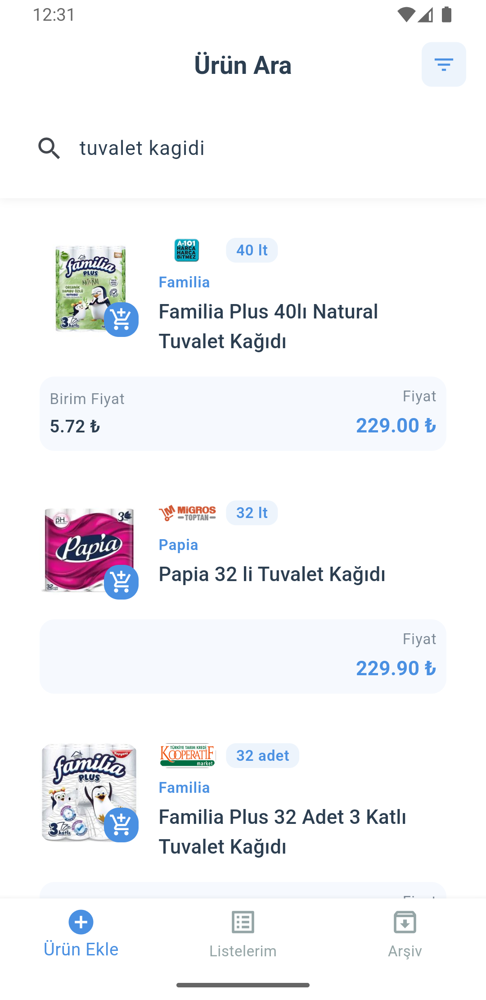
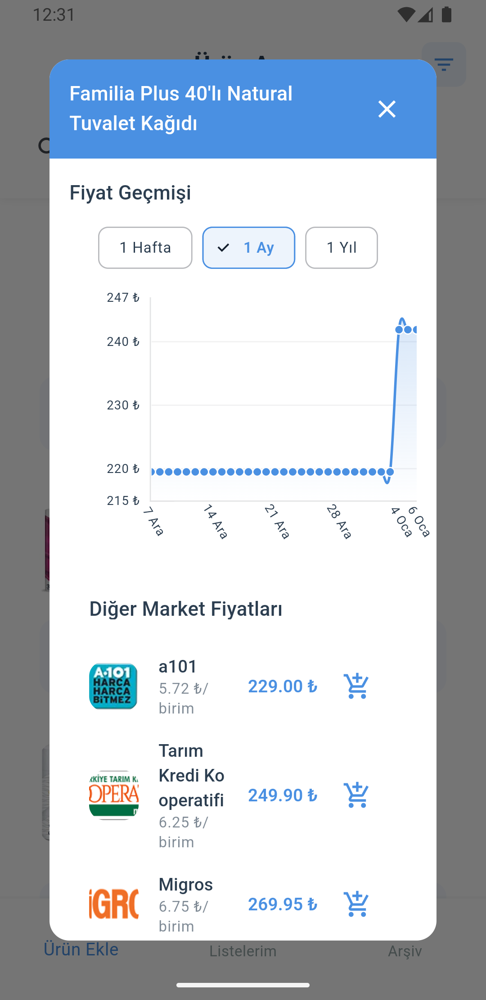
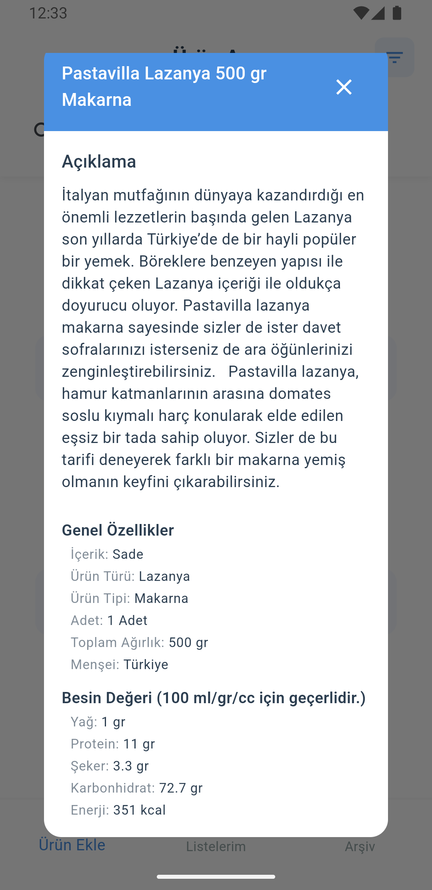
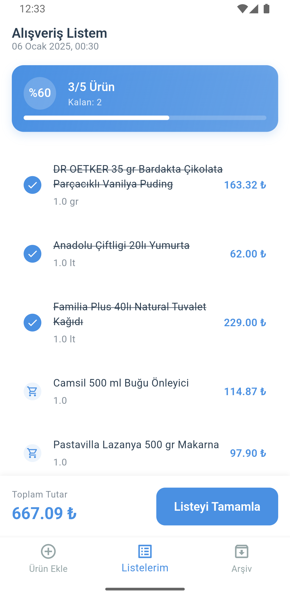
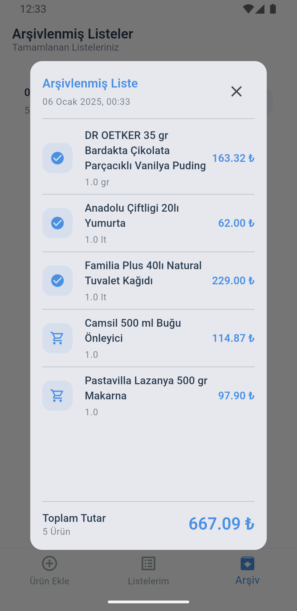

# Akıllı Market Listem

Modern ve kullanıcı dostu bir alışveriş listesi uygulaması.

## Ekran Görüntüleri

<div style="display: flex; flex-wrap: wrap; gap: 10px; justify-content: center;">
  
  
  
  
  
</div>

## Önemli Not

Uygulamayı çalıştırmadan önce `lib/core/constants/api_constants.dart` dosyasındaki `baseUrl` değişkenini kendi API sunucunuzun adresi ile değiştirmeniz gerekmektedir.

## API Kaynağı

Bu uygulama [Cimri Market API](https://github.com/ruwiss/cimri_market_api) projesini kullanmaktadır. API'yi yerel olarak çalıştırmak için ilgili repoyu klonlayıp kurulumunu yapmanız gerekmektedir.

## Özellikler

- Market ürünlerini arama ve fiyat karşılaştırma
- Alışveriş listesi oluşturma
- Ürün fiyat geçmişi takibi
- Arşivlenmiş listeler
- Modern ve kullanıcı dostu arayüz

## Kurulum

1. Flutter SDK'yı yükleyin
2. Projeyi klonlayın
3. Bağımlılıkları yükleyin:
```bash
flutter pub get
```
4. API URL'sini güncelleyin
5. Uygulamayı çalıştırın:
```bash
flutter run
```
